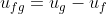
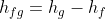
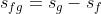

## INTRODUCTION 

The thermodynamics data handbook is a collection of thermodynamic property values under various physical conditions, used to assist mechanical engineers while solving thermodynamics problems to obtain certain thermodynamic values under standard conditions. The handbook can be used to obtain the values of some commonly used thermodynamics constants, ideal gas properties of various gases, the thermodynamics and fluid properties of saturated and superheated water or refrigerant-134a etc. It also contains charts such as T-s diagrams, Mollier charts, compressibility chart etc.

#### User Objectives and Goals:

  1.  Understand the use of the thermodynamics data handbook and the concept behind the saturated and superheated water tables.
  2.  Understand the various thermodynamics properties such as the enthalpy, internal energy, entropy and their units.
  3. Visualize the required quantities in the table that have been marked.
  4. Calculate the specific thermodynamics properties using the necessary values from the table.

#### Theory

The thermodynamics data handbook is a collection of thermodynamic property values under various physical conditions, used to assist mechanical engineers while solving thermodynamics problems to obtain certain thermodynamic values under standard conditions. The handbook can be used to obtain the values of some commonly used thermodynamics constants, ideal gas properties of various gases, the thermodynamics and fluid properties of saturated and superheated water or refrigerant-134a etc. It also contains charts such as T-s diagrams, Mollier charts, compressibility chart etc.

It is important for a student to understand how to use the thermodynamics data handbook to obtain the thermodynamics values, but this process is not very straightforward. Hence, this experiment demonstrates how to use two commonly used tables from the data handbook: the saturated water table and the superheated water table.

The saturated water table is used to determine the properties of water when it is in the saturated condition i.e. it is in equilibrium with the steam at the same pressure and has not been completely boiled yet. In this table, given the water’s temperature (or pressure), thermodynamic quantities such as the saturated pressure (or temperature), specific volume, enthalpy, internal energy, entropy can be determined.

The superheated water table is used to determine the thermodynamic properties of water when it is in the superheated condition i.e. the water has been heated above its boiling point and dry steam is created, completely devoid of moisture. In this table, given the water’s pressure and temperature, the enthalpy, specific volume, internal energy and entropy can be determined.

#### Abbreviations:

Saturated water table:

1. Tsat = Saturation temperature (℃)
2. Psat = Saturation pressure (kPa)
3. vf = Specific volume at saturated liquid state (m3/kg)
4. vg = Specific volume at saturated vapour state (m3/kg)
5. uf = Specific internal energy at saturated liquid state (kJ/kg)
6. ug = Specific internal energy at saturated vapour state (kJ/kg)
7. ufg = Change in internal energy during evaporation (or condensation) (kJ/kg)
8. hf = Specific enthalpy at saturated liquid state (kJ/kg)
9. hg = Specific enthalpy at saturated vapour state (kJ/kg)
10. hfg = Change in enthalpy during evaporation (or condensation) (kJ/kg)
11. sf = Specific entropy at saturated liquid state (kJ/kg.K)
12. sg = Specific entropy at saturated vapour state (kJ/kg.K)
13. sfg = Change in entropy during evaporation (or condensation) (kJ/kg.K)

Superheated water table:

1. v = Specific volume (m3/kg)
2. u = Specific internal energy (kJ/kg)
3. h = Specific enthalpy (kJ/kg)
4. s = Specific entropy (kJ/kg.K)

#### Equations/formulae:

 

 

 
