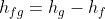

## Storyboard (Round 2)

Experiment: Thermodynamics Data Handbook

**1. Story Outline**:

The thermodynamics data handbook is a collection of thermodynamic property values under various physical conditions, used to assist mechanical engineers while solving thermodynamics problems to obtain certain thermodynamic values under standard conditions. The handbook can be used to obtain the values of some commonly used thermodynamics constants, ideal gas properties of various gases, the thermodynamics and fluid properties of saturated and superheated water or refrigerant-134a etc. It also contains charts such as T-s diagrams, Mollier charts, compressibility charts etc.

It is important for a student to understand how to use the thermodynamics data handbook to obtain the thermodynamics values, but this process is not very straightforward. Hence, this experiment demonstrates how to use two commonly used tables from the data handbook: the saturated water table and the superheated water table.

The saturated water table is used to determine the properties of water when it is in the saturated condition i.e. it is in equilibrium with the steam at the same pressure and has not been completely boiled yet. In this table, given the water’s temperature (or pressure), thermodynamic quantities such as the saturated pressure (or temperature), specific volume, enthalpy, internal energy, entropy can be determined.

The superheated water table is used to determine the thermodynamic properties of water when it is in the superheated condition i.e. the water has been heated above its boiling point and dry steam is created, completely devoid of moisture. In this table, given the water’s pressure and temperature, the enthalpy, specific volume, internal energy and entropy can be determined.

 **2. Story**:

  **2.1 Set the visual stage description**:

  The experiment consists of the saturated water table and the superheated water table of the thermodynamics data handbook. All the buttons and parameters control the right corner of the frame. The variable panel contains radio buttons to choose either saturated or superheated water table. Upon choosing a saturated table, there are two radio buttons to choose either the pressure or the temperature. Both quantities have a drop-down menu of values. Upon choosing the superheated table, there are drop-down menus for pressure and temperature.

  The setup consists of the saturated water table (Table A-6) and the superheated water table (Table A-7).

  By changing the parameters such as the pressure and temperature for either of the two tables, the corresponding thermodynamic values are marked on the table.

  **2.2 Set User Objectives & Goals**:

  *  Understand the use of the thermodynamics data handbook and the concept behind the saturated and superheated water tables.
  *  Understand the various thermodynamics properties such as the enthalpy, internal energy, entropy and their units.
  *  Visualize the required quantities in the table that have been marked
  *  Calculate the specific thermodynamics properties using the necessary values from the table.

  **2.3 Set the pathway activities**:

  1.  Initially, the two radio buttons for the saturated and the superheated water tables are provided. The superheated water table is displayed on the canvas.
  2.  The tables can be selected using the radio button.
  3.  Either the pressure or the temperature values can be selected using the drop-down menus for the saturated water table.
  4.  Both the pressure and the temperature values can be selected using the drop-down menus for the superheated water table.
  5.  Change the parameters of the system to understand the process of selecting values from the two tables..

  **2.4 Set Challenges and Questions/Complexity/variation**

  **2.4.a Questions before simulation**:

  1. When water is heated to its boiling point, it turns into saturated steam.

  <ol type="a">
   <li>True</li>
   <li>False</li>
   </ol>

   Answer: a

  2. How much moisture content does superheated steam have?

  <ol type="a">
  <li>0%</li>
  <li>5%</li>
  <li>100%</li>
  </ol>

  Answer: a

  3. The term vf denotes:

  <ol type="a">
  <li>Specific volume at superheated liquid state</li>
  <li>volume at saturated vapour state</li>
  <li>Specific volume at saturated liquid state</li>
  <li>Specific volume at superheated vapour state</li>
  </ol>

  Answer: c

  4. What is the saturation temperature for water at a pressure of 1000 kPa?

   <ol type="a">
  <li>255.6℃</li>
  <li>179.88℃</li>
  <li>154.5℃</li>
  <li>196℃</li>
  </ol>

  Answer: b

**2.4.b Questions after simulation**

  1. Lowering the temperature of superheated steam will condense it back to its original liquid state.

  <ol type="a">
  <li> True</li>
  <li> False</li>
  </ol>

  Answer: b

  2. Which of the following is a poor conductor of heat?

  <ol type="a">
  <li> Saturated water</li>
  <li> Saturated steam</li>
  <li> Superheated steam</li>
  </ol>

  Answer: b

  3. What is the change in internal energy for saturated water at 200℃?

  <ol type="a">
  <li> 2594.2 kJ/kg</li>
  <li> 850.46 kJ/kg</li>
  <li>1743.74 kJ/kg</li>
  <li>1267.5 kJ/kg</li>
  </ol>

  Answer: d

  4. For superheated water at 0.3MPa and 600℃, what is the specific entropy?

  <ol type="a">
  <li>1.34 kJ/kgK</li>
  <li>8.59 kJ/kgK</li>
  <li>2.76 kJ/kgK</li>
  <li>88 kJ/kgK</li>
  </ol>
Answer: b

**2.5 Allow pitfalls: NA**

**2.6 Conclusion**:

The time required to perform the virtual experiment.

The approximate time required to understand the procedure and perform the experiment is about 5 mins. The time required to locate the various thermodynamics properties in the data handbook based on the values chosen is about 5 mins. Thus, the total time required to perform the experiment is about 10 mins.

**2.7 Abbreviations:**

Saturated water table:

1. Tsat = Saturation temperature (℃)
2. Psat = Saturation pressure (kPa)
3. vf = Specific volume at saturated liquid state (m3/kg)
4. vg = Specific volume at saturated vapour state (m3/kg)
5. uf = Specific internal energy at saturated liquid state (kJ/kg)
6. ug = Specific internal energy at saturated vapour state (kJ/kg)
7. ufg = Change in internal energy during evaporation (or condensation) (kJ/kg)
8. hf = Specific enthalpy at saturated liquid state (kJ/kg)
9. hg = Specific enthalpy at saturated vapour state (kJ/kg)
10. hfg = Change in enthalpy during evaporation (or condensation) (kJ/kg)
11. sf = Specific entropy at saturated liquid state (kJ/kg.K)
12. sg = Specific entropy at saturated vapour state (kJ/kg.K)
13. sfg = Change in entropy during evaporation (or condensation) (kJ/kg.K)

Superheated water table:

1. v = Specific volume (m3/kg)
2. u = Specific internal energy (kJ/kg)
3. h = Specific enthalpy (kJ/kg)
4. s = Specific entropy (kJ/kg.K)

**2.8 Equations/formulae:**

 

 

 
 

<!-- # Below are the examples added for reference.
# To get mathematical equatios in html format: go to link: https://www.codecogs.com/latex/eqneditor.php and download equations in png format
# In the same link you have option to download equation as punching

### using png -->
<!--
//markdown syntax -->

<!-- //html syntax

 -->

**3. Flowchart**:

**4. Mindmap**:

**5. storyboard**:
1. In the simulation window, the thermodynamics data handbook saturated and superheated water tables are available.
2. The instructions, symbols and the formulae are displayed in the control panel when the cursor hovers over ‘Instructions’, ‘Abbreviations’ and ‘Formulae’ respectively.
3. The parameters can be changed by changing the variables as shown.
4. Use the drop-down menu to select the pressure and temperature values for the saturated and superheated water tables.
5. The thermodynamic properties (pressure and temperature), specific volume, specific internal energy, specific enthalpy and specific entropy values are given at the bottom.

**6. References**:

Basic and Applied Thermodynamics - P.K. Nag
Thermodynamics : An engineering approach - Cengel and Boles
